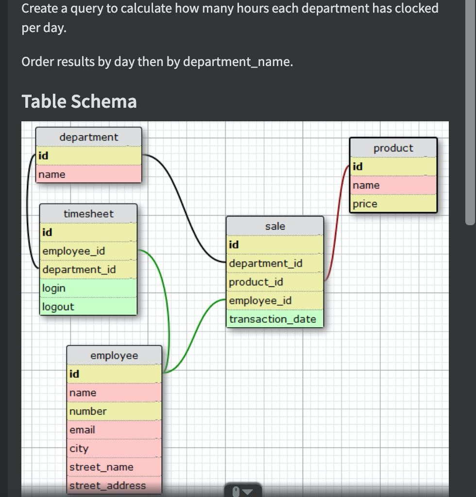
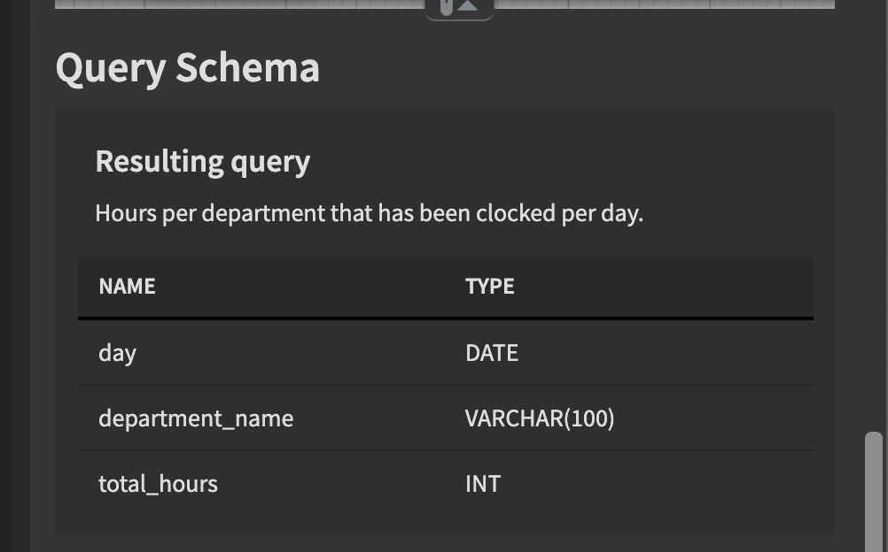

# January 2021

Some coding tasks.

## task 1
If we list all the natural numbers below 10 that are multiplies of 3 or 5, we get 3,5,6,9. The sum is 23.

Finish the solution so that it returns the sum of all multiplies of 3 or 5 below the number passed in.

Example:
````
input, output
10, 23 
````

## task 2
You are provided a string of positive integers separated by a space (""). Take each value and calculate the sum of
digits, which we call its "weight". Then return the list in ASC order by weight, as a string joined by a space.

Example:
```
number, weight
99, 18
100, 1

100 will come BEFORE 99
````
 
Example:
````
"56 65 74 100 99 68 86 180 90" ordered by numbers weights becomes:
"100 180 90 56 65 74 68 86 99"
180 is before 90 since, having the same "weight" (9) it comes before as a string.
````

## task 3
Write a function called validBraces that takes a string of braces, and determine if the order of the braces 
is valid. 

All input strings will be nonempty and only consist of 
```
(, ), [, ], {, }
``` 

A string of braces is considered valid if all braces are matched with correct brace.

Example:
````
(){}[] - valid
([)] - not valid
(} - not valid
([{}]) - valid
````  

## task 4




