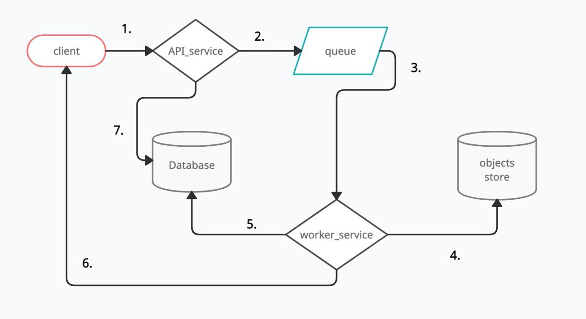

# December 2020

## Задача

Описать компоненты сервиса, отвечающего за загрузку видео в фоновом режиме с помощью мобильного приложения. 
Сервис должен показывать индикатор "загрузки" и уведомлять пользователя о завершении.

## Решение

Основные компоненты сервиса представлены на рисунке:
* **client** - мобильное приложение, из которого происходят запросы в основной сервис
* **API_service** - сервис, который принимает запросы от мобильного приложения 
* **queue** - очередь, в которую API_service пишет события для выполнения (загрузку видео)
* **worker_service** - сервис, который читает события из очереди, загружает видео в хранилище объектов,
 пишет об результате в базу данных и отправляет пуш уведомление клиенту после завершения загрузки видео 
* **objects storage** - хранилище объектов (видео)
* **Database** - база данных с информацией о загруженных видео

Основные действия:
1) отправка запросов от клиента к **API_Service**
2) запись событий в очередь
3) чтение событий из очереди
4) загрузка объектов (видео) в хранилище
5) отправка информации о видео в базу данных
6) отправка push уведомления пользователю о завершении загрузки видео 
7) чтение информации о видео из базы данных

**Database** хранит следующую информацию:
1) **user_id** - уникальный идентификатор пользователя
2) **[]video_info** - массив объектов с информацией о видео
    
**video_info** содержит следующую информацию:
1) **video_id** - уникальный идентификатор видео
2) **status** - статус видео, может принимать значения: **PENDING** (ожидает загрузки), **LOADING** (загружается), **UPLOADED** (загружено),
**DELETED** (удалено), **FAILED** (загрузка провалилась)
3) **meta_info** - информацию о видео (размер, название, время загрузки видео etc)
4) **uploaded_percentage** - кол-во процентов загруженного видео

Как происходит работа:
1) Пользователь отправляет запрос с загрузкой видео в **API_service**
2) **API_service** кладет событие по загрузке в очередь и отдает клиенту информацию, что видео **PENDING**
3) **worker_service** подхватывает из очереди событие, пишет в БД начальную информацию о загрузке видео (**meta_info**
, **status** равный **PENDING**) и готовит данные к загрузке в **objects storage**.
4) Во время загрузки меняет **status** в БД на **LOADING** и периодически проверяет сколько данных
загрузилось и обновляет информацию в БД.
5) клиент в фоновом режиме периодически ходит в **API_service**, чтобы получить информацию о видео. **API_service**
читает из БД информацию о видео и показывает ее пользователю.
6) В определенный момент видео загружается, **worker_service** обновляет информацию о видео в БД на **UPLOADED** и
отправляет push-уведомление пользователю. **client** перестает в фоновом режиме ходить в **API_service**
за информацией о прогрессе загрузки. 

